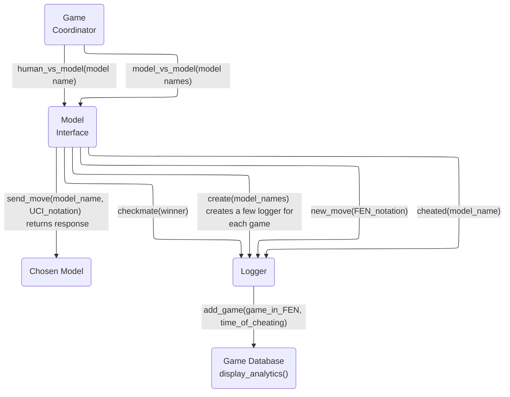

Check out the configuration reference at https://huggingface.co/docs/hub/spaces-config-reference

```mermaid
---
config:
    flowchart:
        defaultRenderer: elk
---
flowchart TB
interface(Model \n Interface)
model(Chosen Model)
logger(Logger)
coordinator(Game \n Coordinator)
database("Game Database \n display_analytics()")

coordinator --model_vs_model(model names)-->interface
coordinator --human_vs_model(model name) -->interface

interface --send_move(model_name, UCI_notation) \n returns response-->model

interface --create(model_names) \n creates a few logger for each game--> logger
interface --new_move(FEN_notation)-->logger
interface--cheated(model_name)-->logger
interface--checkmate(winner)-->logger

logger --add_game(game_in_FEN, time_of_cheating)-->database
```

