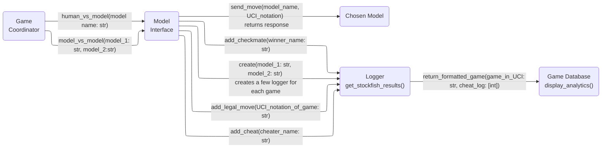

```mermaid
---
config:
    flowchart:
        defaultRenderer: elk
---
flowchart LR
interface(Model \n Interface)
model(Chosen Model)
logger("Logger\nget_stockfish_results()")
coordinator(Game \n Coordinator)
database("Game Database \n display_analytics()")

coordinator --model_vs_model(model_1: str, model_2:str)-->interface
coordinator --human_vs_model(model name: str) -->interface

interface --send_move(model_name, UCI_notation) \n returns response-->model

interface --create(model_1: str, model_2: str) \n creates a few logger for each game--> logger
interface --add_legal_move(UCI_notation_of_game: str)-->logger
interface--add_cheat(cheater_name: str)-->logger
interface--add_checkmate(winner_name: str)-->logger

logger --return_formatted_game(game_in_UCI: str, cheat_log: [int])-->database
```